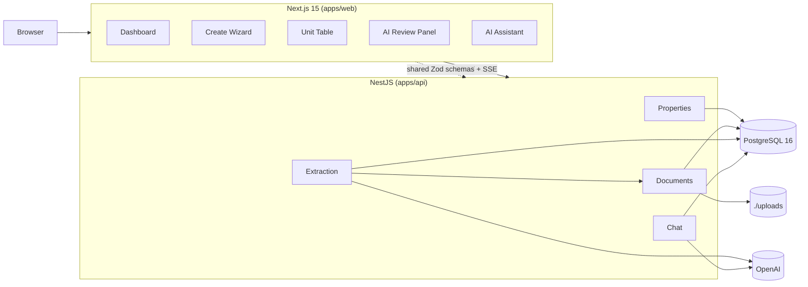

# Architecture

System design, data model, and operational choices.

---

## High-level

Two Node services (Next.js web, NestJS API) over a single PostgreSQL database. OpenAI is used for two purposes: structured extraction of Teilungserklärung documents, and the data-aware chat assistant. No queues, caches, or background services beyond what Postgres provides.

The web app is locale-aware out of the box. `next-intl` routes through a `[locale]` segment; English and German message catalogs live in `messages/{en,de}.json`. Default locale is `de` to match the primary market; domain terms (WEG, MV, MEA, Teilungserklärung, Wohnfläche, Nutzfläche) are kept German across both locales.



---

## Repository layout

A pnpm monorepo with two apps and one shared package. Schemas defined once in `packages/shared` are consumed by both client (RHF resolver) and server (NestJS validation pipe) — and used as the JSON schema for OpenAI structured output. Single source of truth, no drift.

```
buena-case-study/
├── apps/
│   ├── web/                  # Next.js 15
│   └── api/                  # NestJS
├── packages/
│   └── shared/               # Zod schemas + types
├── prisma/
│   ├── schema.prisma
│   ├── migrations/
│   └── seed.ts
├── docs/
└── docker-compose.yml
```

---

## Stack

| Layer | Choice |
|---|---|
| Frontend | Next.js 15 (App Router), TypeScript |
| UI | Tailwind + shadcn/ui |
| Forms | React Hook Form + Zod resolver |
| Tables | TanStack Table (headless) + TanStack Virtual |
| API client | TanStack Query |
| Backend | NestJS, TypeScript |
| ORM | Prisma |
| Database | PostgreSQL 16 |
| Validation | Zod (shared package) |
| AI | OpenAI gpt-4o-mini, structured outputs (json_schema mode) |
| PDF | pdf-parse, pdfjs-dist as fallback |
| i18n | next-intl, en + de catalogs, locale-aware route segment |
| Security | helmet, CORS allowlist, structured error envelope, pino redaction |
| Rate limit / idempotency | `@nestjs/throttler` on AI endpoints; per-document idempotency cache |
| Tests | Vitest, Playwright |
| Bundle | Docker Compose |
| CI | GitHub Actions (lint + typecheck + test + build on every push) |
| Lint / format | ESLint, Prettier, Husky pre-commit |

Rationale per choice in the ADRs.

---

## Data model

```prisma
generator client { provider = "prisma-client-js" }
datasource db    { provider = "postgresql"; url = env("DATABASE_URL") }

enum ManagementType { WEG MV }
enum UnitType       { APARTMENT OFFICE GARDEN PARKING }
enum FloorKind      { EG OG UG DG STAFFEL }
enum AreaMetric     { WOHN NUTZ ROH GROUND }

model Tenant {
  id          String     @id @default(cuid())
  name        String
  createdAt   DateTime   @default(now())
  properties  Property[]
  contacts    Contact[]
}

model Property {
  id                String          @id @default(cuid())
  tenantId          String
  tenant            Tenant          @relation(fields: [tenantId], references: [id])
  name              String
  uniqueNumber      String
  managementType    ManagementType

  totalMea          Decimal?        @db.Decimal(10, 2)
  notarialRollNo    String?
  notarizedAt       DateTime?
  declarationFileId String?

  grundbuchOffice   String?
  grundbuchSheet    String?
  gemarkung         String?
  flur              String?
  flurstueck        String?
  totalAreaSqm      Decimal?        @db.Decimal(10, 2)

  propertyManagerId String?
  propertyManager   Contact?        @relation("propertyManager", fields: [propertyManagerId], references: [id])
  accountantId      String?
  accountant        Contact?        @relation("accountant",      fields: [accountantId],      references: [id])

  buildings         Building[]
  declarationFile   Document?       @relation(fields: [declarationFileId], references: [id])

  createdAt         DateTime        @default(now())
  updatedAt         DateTime        @updatedAt

  @@unique([tenantId, uniqueNumber])
  @@index([tenantId])
}

model Building {
  id              String   @id @default(cuid())
  propertyId      String
  property        Property @relation(fields: [propertyId], references: [id], onDelete: Cascade)

  street          String
  houseNumber     String
  postalCode      String?
  city            String?
  country         String?  @default("DE")
  label           String?
  nickname        String?
  yearBuilt       Int?
  floorsCount     Int?
  hasElevator     Boolean? @default(false)
  energyStandard  String?
  heating         String?
  buildingType    String?

  units           Unit[]

  @@index([propertyId])
}

model Unit {
  id              String     @id @default(cuid())
  buildingId      String
  building        Building   @relation(fields: [buildingId], references: [id], onDelete: Cascade)

  number          String
  type            UnitType

  floorKind       FloorKind?
  floorLevel      Int?
  floorQualifier  String?

  entranceLabel   String?
  entranceNote    String?

  sizeSqm         Decimal?   @db.Decimal(10, 2)
  areaMetric      AreaMetric?

  meaShare        Decimal    @db.Decimal(10, 2)

  rooms           Int?
  yearBuilt       Int?
  subCategory     String?
  description     String?

  createdAt       DateTime   @default(now())
  updatedAt       DateTime   @updatedAt

  @@unique([buildingId, number])
  @@index([buildingId])
}

model Contact {
  id          String   @id @default(cuid())
  tenantId    String
  tenant      Tenant   @relation(fields: [tenantId], references: [id])

  name        String
  role        String
  street      String?
  houseNumber String?
  postalCode  String?
  city        String?
  email       String?
  phone       String?

  managedProperties     Property[] @relation("propertyManager")
  accountedProperties   Property[] @relation("accountant")

  @@index([tenantId])
}

model Document {
  id          String   @id @default(cuid())
  tenantId    String
  filename    String
  mimeType    String
  bytes       Int
  storageKey  String
  createdAt   DateTime @default(now())

  property    Property?
}

model ExtractionRun {
  id            String   @id @default(cuid())
  documentId    String
  document      Document @relation(fields: [documentId], references: [id])
  model         String
  promptVersion String
  rawResponse   Json
  parsedResult  Json
  confidence    Decimal  @db.Decimal(5, 4)
  durationMs    Int
  status        String
  error         String?
  createdAt     DateTime @default(now())
}
```

### Invariants enforced at the database

- `Property.uniqueNumber` is unique per tenant.
- `Unit.number` is unique per building.
- `Unit.meaShare > 0` (CHECK constraint).
- `Building` and `Unit` cascade-delete with their parent.

### Invariant enforced at the application layer

- **MEA invariant warning** — for WEG properties, the sum of unit shares is compared to the property's declared total. A mismatch is surfaced as a non-blocking warning in API responses and live in the UI. Not a hard block, because real-world declarations sometimes don't reconcile cleanly and we'd rather flag than reject.

---

## Shared schemas (Zod)

Every entity is defined once in `packages/shared`. Discriminated unions are used where the brief or document data shape varies by type — Property by management type, Unit by unit type, Floor by kind.

```ts
// packages/shared/unit.ts (excerpt)

const FloorSchema = z.discriminatedUnion('kind', [
  z.object({ kind: z.literal('EG') }),
  z.object({ kind: z.literal('OG'), level: z.number().int().min(1).max(99), qualifier: z.string().optional() }),
  z.object({ kind: z.literal('UG'), level: z.number().int().min(1).max(9) }),
  z.object({ kind: z.literal('DG') }),
  z.object({ kind: z.literal('STAFFEL') }),
]);

const BaseUnit = z.object({
  number: z.string().min(1),
  buildingId: z.string().cuid(),
  meaShare: z.number().nonnegative().max(10000),
  yearBuilt: z.number().int().min(1800).max(new Date().getFullYear() + 1).optional(),
  floor: FloorSchema.optional(),
  entranceLabel: z.string().optional(),
  entranceNote: z.string().optional(),
  description: z.string().max(500).optional(),
});

export const UnitSchema = z.discriminatedUnion('type', [
  BaseUnit.extend({
    type: z.literal('APARTMENT'),
    sizeSqm: z.number().positive(),
    areaMetric: z.literal('WOHN'),
    rooms: z.number().int().min(0).max(50),
    subCategory: z.string().optional(),
  }),
  BaseUnit.extend({
    type: z.literal('OFFICE'),
    sizeSqm: z.number().positive(),
    areaMetric: z.literal('NUTZ'),
    layoutNote: z.string().optional(),
  }),
  BaseUnit.extend({
    type: z.literal('PARKING'),
    sizeSqm: z.number().positive(),
    areaMetric: z.literal('NUTZ'),
    parkingCode: z.string().optional(),
  }),
  BaseUnit.extend({
    type: z.literal('GARDEN'),
    sizeSqm: z.number().positive(),
    areaMetric: z.literal('GROUND'),
  }),
]);
```

---

## API surface

REST, NestJS. Each endpoint validated with Zod via a global `ZodValidationPipe`. Errors return a structured envelope: `{ error: { code, message, details?, requestId } }`. AI endpoints are rate-limited (`POST /extraction/runs`: 5/min/IP, `POST /chat/messages`: 30/min/session) and protected by `helmet` + an explicit CORS allowlist.

```
GET    /properties                      list (dashboard pagination)
POST   /properties                      atomic create (property + buildings + units, single transaction)
GET    /properties/:id                  full detail
PATCH  /properties/:id                  partial update
DELETE /properties/:id                  cascade delete

POST   /properties/:id/buildings        add building
PATCH  /buildings/:id
DELETE /buildings/:id

POST   /buildings/:id/units             bulk insert
PATCH  /units/:id
DELETE /units/:id

POST   /documents                       multipart PDF upload
GET    /documents/:id                   metadata

POST   /extraction/runs                 { documentId } → ExtractionResult (synchronous)
                                        ?force=true bypasses the per-document idempotency cache
GET    /extraction/runs/:id

POST   /contacts                        create
GET    /contacts?role=...               suggest existing

POST   /chat/messages                   SSE stream of assistant replies
```

`POST /properties` is the atomic create — accepts the full payload and runs within a single Prisma transaction. The wizard auto-saves draft state to localStorage as the user types but does not save to the server until the user explicitly finishes. This trades a small risk of unsaved data on tab close for a much simpler server-side state machine.

---

## AI extraction flow

```
PDF upload
  └─ POST /documents → documentId
PDF text extraction (pdf-parse → pdfjs-dist fallback)
Pre-call token guard: > 25K tokens → ExtractionError('document_too_large')
Idempotency cache lookup keyed by documentId — hit returns cached run with cached: true
OpenAI gpt-4o-mini call with strict JSON schema (zod-to-json-schema of ExtractionResult)
Validate with Zod (same schema)
Source-span verification: every claimed sourceSpansByField entry checked with indexOf
  against the original PDF text; unverified spans dropped before response
Compute MEA invariant
Persist ExtractionRun row
Return { extraction, warnings, confidence, durationMs, cached }
Client renders Review Panel — confidence chips per field, verified source spans, warnings
User accepts (form pre-fills) or discards (manual entry continues)
```

Three guarantees the design buys:
1. **Schema-first** — output is structurally valid by construction (`json_schema` strict mode + Zod re-parse).
2. **Grounded** — source spans are verified server-side; the model cannot fabricate citations.
3. **Idempotent** — re-uploading the same document doesn't re-spend; `?force=true` bypasses the cache when iterating prompts.

Detailed prompt design and schema in `adr-02-ai-extraction.md`. Quality is measured against `tests/extraction/eval.json` via `pnpm extraction:eval`.

---

## Frontend wizard

A single client-side state machine driven by a parent React Hook Form context. Three steps; navigation requires the current step's Zod validation to pass; back navigation is always allowed. State persisted to localStorage on every change, restored on mount.

The unit step uses a custom table built on TanStack Table headless API, with inline editing, full keyboard navigation, paste-from-clipboard, batch generation, virtualization for large datasets, and a sticky live MEA total bar.

---

## Running it locally

The project ships two compose files:

`docker-compose.yml` — full bundle. One command brings up Postgres, runs migrations, runs the seed, starts the API, starts the web app.

```bash
cp .env.example .env   # paste OPENAI_API_KEY
docker compose up
```

`docker-compose.dev.yml` — Postgres only, for hot-reloading development:

```bash
pnpm install
pnpm db:up
pnpm db:migrate
pnpm db:seed
pnpm dev
```

Dependency surface for review: Docker and an OpenAI API key. Nothing else.

---

## Observability & error handling

Structured JSON logging via pino-http. Each request carries a `requestId`. `pino` is configured with a redaction list (`authorization`, `cookie`, `OPENAI_API_KEY`, request bodies of `POST /documents`) so secrets and binary uploads never land in logs. Each extraction run logs model, latency, token count, parse outcome.

The Next.js app ships three error boundaries: `app/error.tsx` (segment-level), `app/not-found.tsx` (404), and `app/global-error.tsx` (root fallback with inline styles, no Tailwind, no client components — works even if the shell fails to load). Every error page surfaces the `requestId` so support can trace a session end-to-end.

Frontend errors surfaced via a small in-app toast layer with copyable `requestId`. In production, this would be wired to Sentry and request tracing; for the case study, structured stdout logs are sufficient and visible.

---

## Scope notes

This implementation focuses on the WEG path (the legally complex case the sample document represents). MV is supported via the management-type toggle and a reduced General Info form, but its full lifecycle (lease management, rent collection, maintenance ticketing) is intentionally out of scope. The schema models both shapes; future MV-specific features land as additive tables, not refactors.

Authentication and multi-tenant isolation are out of scope: the application assumes a single demo tenant, with `tenantId` columns in place so adding auth is a config and middleware change rather than a schema change. File storage is local disk under `./uploads/`; a stub interface exists so the service can be swapped to S3 without touching call sites.
